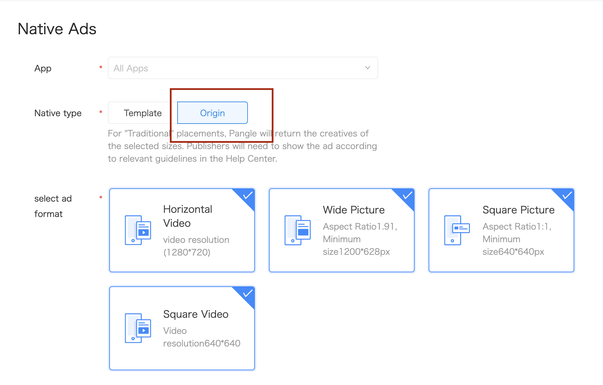
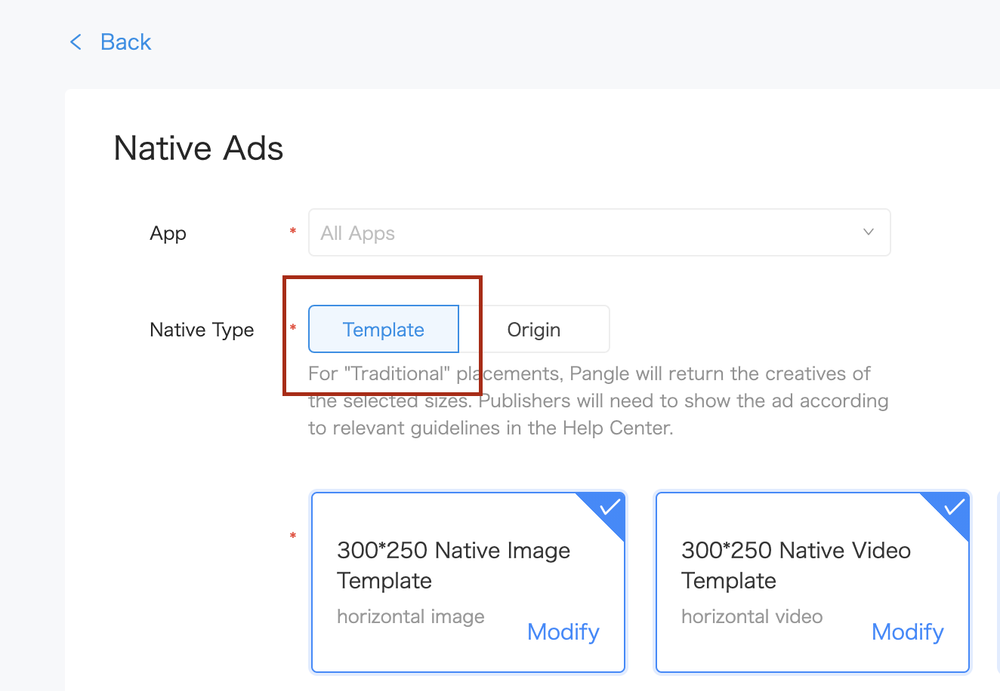

# 2. Native Ads


* [Origin Native Ads](#start/native_ad_origin)
  * [Loading Ads](#start/native_ad_origin_load)
  * [Determining load events](#start/native_ad_origin_loadevent)
  * [Displaying Ads and Registering Ads](#start/native_ad_origin_display)
* [Template Native Ads](#start/native_ad_template)
  * [Loading Ads](#start/native_ad_template_load)
  * [Determining load events](#start/native_ad_template_loadevent)
  * [Displaying Ads](#start/native_ad_template_display)


This chapter will explain the procedure for displaying the native ads in the application.

Please [integrate Pangle SDK](1-integrate_en.md) before load ads.


<a name="start/native_ad_origin"></a>
## Origin Native Ads

<a name="start/native_ad_origin_load"></a>
### Loading Ads

On Pangle platform, create an **Origin** ad in the app, you will get a **placement ID** for ad's loading.




In your application, create a `slot` for setting size and type for the ad and  use `BUNativeAdsManager` to load ads.

```swift
class YourNativeAdsViewController: UIViewController {

    var adManager: BUNativeAdsManager!

    //placementID : the ID when you created a placement
    //count: the counts you want to download,DO NOT set more than 3
    func requestNativeAds(placementID:String, count:Int) {
        let slot = BUAdSlot.init()
        slot.id = placementID
        slot.adType = BUAdSlotAdType.feed
        slot.position = BUAdSlotPosition.feed
        let size = BUSize.init()
        size.width = 1280
        size.height = 720
        slot.imgSize = size
        adManager = BUNativeAdsManager.init(slot: slot)

        // for BUNativeAdsManagerDelegate
        adManager.delegate = self

        adManager.loadAdData(withCount: count)
    }

    ...

```

<a name="start/native_ad_origin_loadevent"></a>
### Determining load events

`BUNativeAdsManagerDelegate` indicates the result of ad's load. If ad is loaded,
**must set `rootViewController` of nativeAd for ad's displaying.
Please make sure the rootViewController does not present other View Controller otherwise present ad will fail because prestentedViewController already exists.**

```swift
extension YourNativeAdsViewController: BUNativeAdsManagerDelegate {
    func nativeAdsManagerSuccess(toLoad adsManager: BUNativeAdsManager, nativeAds nativeAdDataArray: [BUNativeAd]?) {

        nativeAdDataArray?.forEach { nativeAd in
            //each BUNativeAd object has datas for displaying
            nativeAd.rootViewController = self
        }
    }

    func nativeAdsManager(_ adsManager: BUNativeAdsManager, didFailWithError error: Error?) {
        print("\(#function)  failed with error: \(String(describing: error?.localizedDescription))")
    }
}
```

<a name="start/native_ad_origin_display"></a>
### Displaying Ads and Registering Ads

`nativeAd`'s parameter `data` has parts like ad's title, description, images for displaying.

if the parameter`imageMode` in the `data` is **BUFeedVideoAdModeImage** or **BUFeedADModeSquareVideo**, please init a `BUNativeAdRelatedView` and call `- (void)refreshData:(BUNativeAd *)nativeAd;` to get videoAdView parts for the ad.

Please add `BUNativeAdRelatedView`'s `logoADImageView` on ad's view, this view will show the privacy information when been clicked.

**Must** register clickable view in the ad via `BUNativeAd`'s` (void)registerContainer:(__kindof UIView *)containerView
       withClickableViews:(NSArray<__kindof UIView *> *_Nullable)clickableViews;`. You can set clickable area of the ad(etc. button/image/video) and this method will response to user clicks to redirected to the landing page, and **also watching the ad to trigger the impression event**.


```swift
class NativeAdCellTableViewCell: UITableViewCell {

    ...

    @IBOutlet weak var title: UILabel!
    @IBOutlet weak var desc: UILabel!
    @IBOutlet weak var containerView: UIView!
    @IBOutlet weak var logoView: UIView!
    @IBOutlet weak var adLabel: UILabel!
    @IBOutlet weak var actionBtn: UIButton!


    var nativeAdRelatedView = BUNativeAdRelatedView.init()

    func setup(nativeAd: BUNativeAd) {
        title.text = nativeAd.data?.adTitle
        desc.text = nativeAd.data?.adDescription
        actionBtn.setTitle(nativeAd.data?.buttonText, for: .normal)
        nativeAd.delegate = self
        nativeAdRelatedView.refreshData(nativeAd)
        adLabel.text = nativeAdRelatedView.adLabel?.text

        if (nativeAd.data?.imageMode == BUFeedADMode.videoAdModeImage || nativeAd.data?.imageMode == BUFeedADMode.videoAdModePortrait) {
            //This is a video ad
            if let videoView = nativeAdRelatedView.videoAdView {
                let videoFrame = CGRect(x: 0, y: 0, width: containerView.frame.width, height: containerView.frame.height)
                videoView.frame = videoFrame
                addPangleLogo(parentView: videoView, nativeAdRelatedView: nativeAdRelatedView)
                containerView.addSubview(videoView)
            }
        } else {
            //This is an image ad
            if let url = URL(string: nativeAd.data?.imageAry.first?.imageURL ?? "") {
                if let data = try? Data(contentsOf: url) {
                    let image = UIImage(data: data)
                    let imageFrame = CGRect(x: 0, y: 0, width: containerView.frame.width, height: containerView.frame.height)
                    let imageView = UIImageView.init(frame: imageFrame)
                    imageView.contentMode = .scaleAspectFit
                    imageView.image = image
                    addPangleLogo(parentView: imageView, nativeAdRelatedView: nativeAdRelatedView)
                    containerView.addSubview(imageView)
                }
            }
        }


        // register the button to be clickable
        nativeAd.registerContainer(containerView, withClickableViews: [actionBtn])
    }

    func addPangleLogo(parentView: UIView, nativeAdRelatedView: BUNativeAdRelatedView) {
        //Pangle Logo, will show privacy information if clicked
        if let pangleLogoView = nativeAdRelatedView.logoADImageView {
            let logoSize:CGFloat = 35.0
            pangleLogoView.frame = CGRect(x:(parentView.frame.width - logoSize) , y:(parentView.frame.height - logoSize), width: logoSize, height: 20)
            parentView.addSubview(pangleLogoView)
        }
    }

    ...

}
```


<a name="start/native_ad_template"></a>
## Template Native Ads

<a name="start/native_ad_template_load"></a>
## Loading Ads

On Pangle platform, create an **Template** ad in the app, you will get a **placement ID** for ad's loading.



In your application, create a `slot` for setting size and type for the ad and use `BUNativeExpressAdManager`'s
`- (instancetype)initWithSlot:(BUAdSlot * _Nullable)slot adSize:(CGSize)size;`
Set the size for the ad's view in function. SDK will return an same size's ad.

```swift
/**
 for template native ad
 */
var templateAdManager: BUNativeExpressAdManager!

//placementID : the ID when you created a placement
//count: the counts you want to download,DO NOT set more than 3
func requestTemplateNativeAds(placementID:String, count:Int) {
    let slot = BUAdSlot.init()
    slot.id = placementID
    slot.adType = BUAdSlotAdType.feed
    slot.position = BUAdSlotPosition.feed
    slot.imgSize = BUSize.init()
    slot.isSupportDeepLink = true
    // Please set your ad view's size here
    let adViewWidth = 300
    let adViewHeight = 250
    templateAdManager = BUNativeExpressAdManager.init(slot: slot, adSize: CGSize(width: adViewWidth, height: adViewHeight))
    templateAdManager.delegate = self
    templateAdManager.loadAd(count)
}
```


<a name="start/native_ad_template_loadevent"></a>
## Determining load events

`BUNativeExpressAdViewDelegate` indicates the result of ad's load. If ad is loaded,
**must call `render()` for rending the ad.**

```swift
// MARK:  BUNativeExpressAdViewDelegate
extension YourNativeAdsViewController: BUNativeExpressAdViewDelegate {
    func nativeExpressAdSuccess(toLoad nativeExpressAd: BUNativeExpressAdManager, views: [BUNativeExpressAdView]) {
        for templateAdView in views {
            // set rootViewController for ad's showing
            templateAdView.rootViewController = self
            templateAdView.render()
        }
    }

    func nativeExpressAdFail(toLoad nativeExpressAd: BUNativeExpressAdManager, error: Error?) {
        print("\(#function)  load template failed with error: \(String(describing: error?.localizedDescription))")
    }
}
```

<a name="start/native_ad_template_display"></a>
## Displaying Ads

If `render()` succeed, ad will be sent to `BUNativeExpressAdViewDelegate`'s `- (void)nativeExpressAdViewRenderSuccess:(BUNativeExpressAdView *)nativeExpressAdView;`.

**Please set `rootViewController` for enabling ad's action.**

If user clicked close button and choose the reason, `func nativeExpressAdView(_ nativeExpressAdView: BUNativeExpressAdView, dislikeWithReason filterWords: [BUDislikeWords])` will be called.


```swift
// MARK:  BUNativeExpressAdViewDelegate
extension YourNativeAdsViewController: BUNativeExpressAdViewDelegate {
    func nativeExpressAdViewRenderSuccess(_ nativeExpressAdView: BUNativeExpressAdView) {
        // here to add nativeExpressAdView for displaying
        contents.insert(nativeExpressAdView, at: adPosition)
        nativeExpressAdView.rootViewController = self
        self.tableView.reloadData()
    }

    func nativeExpressAdViewRenderFail(_ nativeExpressAdView: BUNativeExpressAdView, error: Error?) {
        print("\(#function)  render failed with error: \(String(describing: error?.localizedDescription))")
    }

    func nativeExpressAdView(_ nativeExpressAdView: BUNativeExpressAdView, dislikeWithReason filterWords: [BUDislikeWords]) {
    // do the action (e.g. remove the ad) if ad's dislike reason is been clicked
    }
}
```
