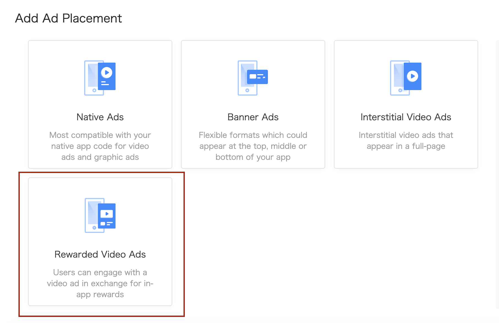

# 3. リワード動画広告


* [リワード動画広告](#start/reward_ad)
  * [リワード動画広告のロード](#start/reward_ad_load)
  * [ロードイベントの受信と広告の表示](#start/reward_ad_loadevent)


この章では、アプリでリワード動画広告を表示する手順について説明します。

広告を利用するには、SDKを有効にする必要があります。詳細は[インストールと初期化](1-integrate_ja.md) をご確認ください。


<a name="start/reward_ad"></a>
## リワード動画広告

<a name="start/reward_ad_load"></a>
### リワード動画広告のロード

Pangle管理画面上にて, 対象アプリに属する**Rewarded Video Ads** 広告を新規してください。 新規したらその広告枠の **placement ID** が生成されます。

新規する際にアプリに合わせた`Orientation` を設定してください。

必要ない場合、`rewards name` と `rewards quantity` をランダムにしてください。


  <br>


アプリ内に`BURewardedVideoModel`を新規してuserIdを設定後に`BURewardedVideoAd`で広告をロードすることが可能です。

`userId` はランダムでも可能です。


```swift
class YourRewardedVideoAdsViewController: UIViewController {

  ...

  var rewardedVideo: BURewardedVideoAd!

  //placementID : the ID when you created a placement
  func requestRewardedVideoAd(placementID: String) {
      let rewardModel = BURewardedVideoModel.init()
      rewardModel.userId = "Your app's user id"

      rewardedVideo = BURewardedVideoAd.init(slotID: placementID, rewardedVideoModel: rewardModel)
      rewardedVideo.delegate = self
      rewardedVideo.loadData()
  }

  ...

```

<a name="start/reward_ad_loadevent"></a>
### ロードイベントの受信と広告の表示

`BURewardedVideoAdDelegate` はリワード広告のロードイベントが発生すると呼び出されます。

`- (BOOL)showAdFromRootViewController:(UIViewController *)rootViewController;`を呼ぶことでリワード広告を表示できます。


```swift
// MARK: BURewardedVideoAdDelegate
extension RewardedVideoViewController: BURewardedVideoAdDelegate {
    func rewardedVideoAdDidLoad(_ rewardedVideoAd: BURewardedVideoAd) {
        print("\(#function)")
    }

    func rewardedVideoAdVideoDidLoad(_ rewardedVideoAd: BURewardedVideoAd) {
        print("\(#function)")
        rewardedVideoAd.show(fromRootViewController: self)
    }

    func rewardedVideoAd(_ rewardedVideoAd: BURewardedVideoAd, didFailWithError error: Error?) {
        print("\(#function)")
    }
}
```
