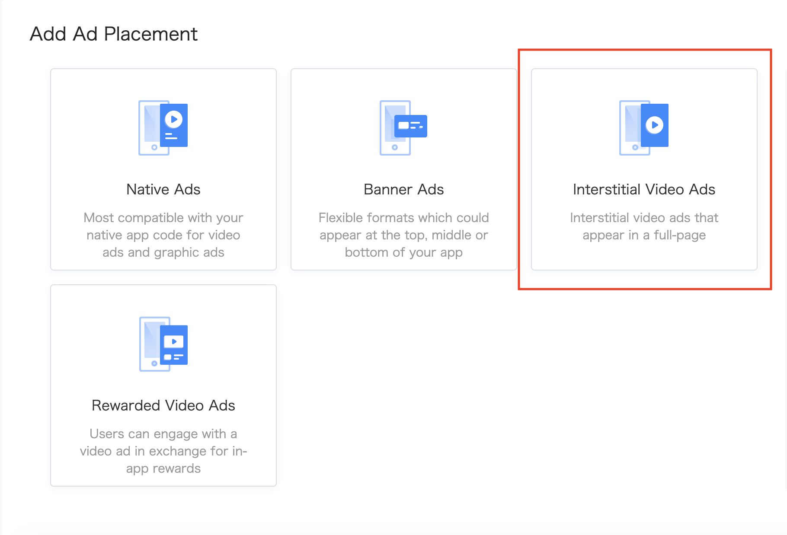
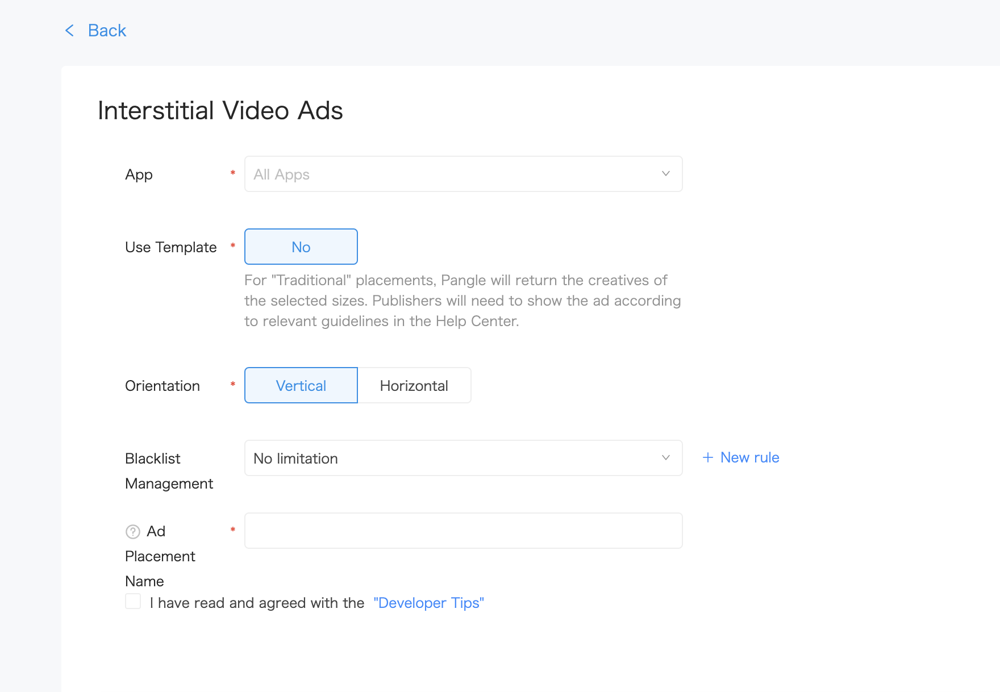

# 4. フルスクリーン動画広告


* [フルスクリーン動画広告](#start/fullscreen_ad)
  * [フルスクリーン動画広告のロード](#start/fullscreen_load)
  * [ロードイベントの受信と広告の表示](#start/fullscreen_loadevent)


この章では、アプリでフルスクリーン動画広告を表示する手順について説明します。

広告を利用するには、SDKを有効にする必要があります。詳細は[インストールと初期化](1-integrate_ja.md) をご確認ください。


<a name="start/fullscreen_ad"></a>
## フルスクリーン動画広告

<a name="start/fullscreen_load"></a>
### フルスクリーン動画広告のロード

Pangle管理画面上にて, 対象アプリに属する**Interstitial Video Ads** 広告を新規してください。 新規したらその広告枠の **placement ID** が生成されます。

新規する際にアプリに合わせた`Orientation` を設定してください。


  <br>




アプリ内に`BUFullscreenVideoAd`を新規して広告をロードすることが可能です。

```swift
class FullScreenVideoViewController: UIViewController {

    ....

    override func viewDidLoad() {
        super.viewDidLoad()

        // Do any additional setup after loading the view.
        requestFullScreenVideoAd(placementID: "your placement id")
    }

    var fullscreenVideoAd: BUFullscreenVideoAd!

    func requestFullScreenVideoAd(placementID: String) {
        fullscreenVideoAd = BUFullscreenVideoAd.init(slotID: placementID)
        fullscreenVideoAd.delegate = self
        fullscreenVideoAd.loadData()
    }

    ...
}

```

<a name="start/fullscreen_loadevent"></a>
### ロードイベントの受信と広告の表示

`BUFullscreenVideoAdDelegate` はリワード広告のロードイベントが発生すると呼び出されます。 `- (BOOL)showAdFromRootViewController:(UIViewController *)rootViewController;` を呼ぶことで広告を表示できます。

```swift
extension FullScreenVideoViewController: BUFullscreenVideoAdDelegate{

    func fullscreenVideoAdVideoDataDidLoad(_ fullscreenVideoAd: BUFullscreenVideoAd) {
        fullscreenVideoAd.show(fromRootViewController: self)
    }

    func fullscreenVideoAd(_ fullscreenVideoAd: BUFullscreenVideoAd, didFailWithError error: Error?) {
        print("\(#function) failed with \(String(describing: error?.localizedDescription))")
    }

}
```
