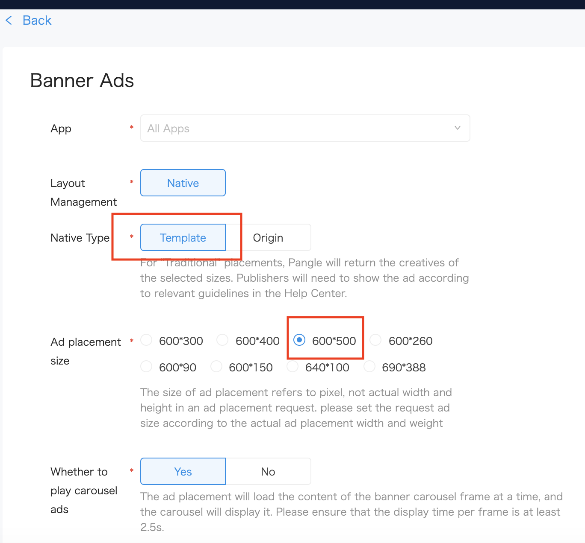

# 5. テンプレートバナー広告


* [テンプレートバナー広告](#start/template_banner_ad)
  * [必要なSDKバージョン](#start/template_banner_support_version)
  * [テンプレートバナー広告のロード](#start/template_banner_ad_load)
  * [ロードイベントの受信と広告の表示](#start/template_banner_ad_loadevent)

この章では、テンプレートバナー広告を表示する手順について説明します。

広告を利用するには、SDKを有効にする必要があります。詳細は[インストールと初期化](1-integrate_ja.md) をご確認ください。


<a name="start/template_banner_ad"></a>
## テンプレートバナー広告

<a name="start/template_banner_support_version"></a>
### 必要なSDKバージョン
以下のSDKバージョンでテンプレートバナー広告をサポートできます
 - Pangle iOS 3.3.0.2 or later

<a name="start/template_banner_ad_load"></a>
### テンプレートバナー広告のロード

Pangle管理画面上にて, 対象アプリに属する**Template Banner** 広告を新規してください。
[Native type]に **Template** を選んでください。

新規したらその広告枠の **placement ID** が生成されます。


**300*250をご利用の場合、[600 * 500] を選んでください.**



**320*50をご利用の場合、[640 * 100] を選んでください.**


アプリ内に`BUNativeExpressBannerView`を新規してサイズを設定すれば広告をロードすることが可能です。

**サイズは300 * 250 または 300 * 250を設定してください。**

```swift
class TemplateBannerAdsViewController: UIViewController {

    var nativeExpressBannerView: BUNativeExpressBannerView!

    // set width to 320 and height to 50 for 320*50
    let bannerSize = CGSize.init(width: 300, height: 250)

    override func viewDidLoad() {
        super.viewDidLoad()

        requestTemplateBannerAd(placementID: "your placement id")
    }

    func requestTemplateBannerAd(placementID:String) {
        nativeExpressBannerView = BUNativeExpressBannerView.init(slotID: placementID, rootViewController: self, adSize: bannerSize)
        nativeExpressBannerView.frame = CGRect.init(x: 0, y: 0, width: bannerSize.width, height: bannerSize.height)
        nativeExpressBannerView.delegate = self
        nativeExpressBannerView.loadAdData()
    }

}

```

<a name="start/template_banner_ad_loadevent"></a>
### ロードイベントの受信と広告の表示

`BUNativeExpressBannerViewDelegate` はテンプレートバナー広告のロードイベントが発生すると呼び出されます。
広告が`rendered`成功したら、広告ビューの`BUNativeExpressBannerView` インスタンスを受け取れます。表示したい場所にセットすれば表示することは可能です。

ユーザーが閉じるボタンを押下したらフィードバックダイアログが表示されます。フィードバック内容を選んだら`func nativeExpressBannerAdView(_ bannerAdView: BUNativeExpressBannerView, dislikeWithReason filterwords: [BUDislikeWords]?)`が呼ばれます。


```swift
extension TemplateBannerAdsViewController: BUNativeExpressBannerViewDelegate{

    func nativeExpressBannerAdViewDidLoad(_ bannerAdView: BUNativeExpressBannerView) {
        print("\(#function)")
    }

    func nativeExpressBannerAdView(_ bannerAdView: BUNativeExpressBannerView, didLoadFailWithError error: Error?) {
        print("\(#function) failed with \(String(describing: error?.localizedDescription))")
    }

    func nativeExpressBannerAdViewRenderSuccess(_ bannerAdView: BUNativeExpressBannerView) {
        print("\(#function) ad size is \(bannerAdView.frame)")
        addBannerViewToView(bannerAdView)
    }

    func nativeExpressBannerAdViewRenderFail(_ bannerAdView: BUNativeExpressBannerView, error: Error?) {
        print("\(#function) failed with \(String(describing: error?.localizedDescription))")
    }

    func nativeExpressBannerAdViewDidClick(_ bannerAdView: BUNativeExpressBannerView) {
        print("\(#function)")
    }

    func nativeExpressBannerAdView(_ bannerAdView: BUNativeExpressBannerView, dislikeWithReason filterwords: [BUDislikeWords]?) {
        //After dislike reason been clicked, please remove the ad for view
        self.nativeExpressBannerView.removeFromSuperview()
    }

    func addBannerViewToView(_ bannerView: UIView) {
        bannerView.translatesAutoresizingMaskIntoConstraints = false
        let x = (view.frame.width - bannerSize.width)/2
        let y = view.frame.height - bannerSize.height
        bannerView.frame = CGRect.init(x: x, y: y, width: bannerSize.width, height: bannerSize.height)
        view.addSubview(bannerView)
    }
}
```
